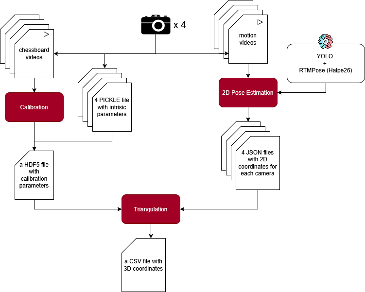
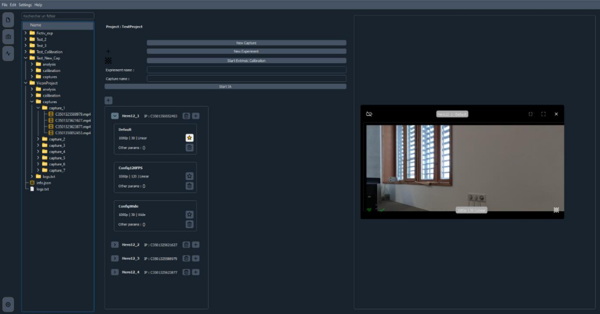

# MoCapIA — Capture de mouvement sans marqueurs par vision et IA

Reconstruction 3D du mouvement humain à partir de plusieurs caméras synchronisées, **sans marqueurs physiques**. Les marqueurs réfléchissants des systèmes optoélectroniques classiques sont remplacés par des points clés détectés automatiquement dans les images, avec pour objectif une précision compatible avec une analyse biomécanique clinique ou sportive.

Stage TN09 — 6 mois, septembre 2025 à février 2026 — laboratoire **BMBI** (BioMécanique et BioIngénierie, CNRS / UTC), équipe **BioMov-E**, plateforme Technologie Sport Santé.

## Contexte

Le laboratoire dispose d'un Vicon T160 : une quarantaine de caméras optoélectroniques jusqu'à 300 images/s, précises au dixième de millimètre. Ces systèmes restent coûteux, longs à installer, et contraignants pour le sujet, qui doit porter des marqueurs susceptibles d'altérer son mouvement naturel — un frein réel à leur adoption en milieu clinique ou sportif.

MoCapIA explore l'alternative *markerless* : quatre GoPro Hero12, un damier de calibration, et des modèles d'estimation de pose. Le Vicon sert alors de référence pour mesurer la précision atteinte.

Le projet est porté par des stages successifs depuis A23. Ce dépôt correspond à **MoCapIA-5** : les fonctions de base (calibration, détection, triangulation, interface) existaient déjà ; l'objectif de ce stage était d'**identifier l'origine des erreurs résiduelles, puis de réduire l'écart avec le Vicon**.

## Pipeline

| Étape | Rôle | Code |
| --- | --- | --- |
| Acquisition | Pilotage et synchronisation des GoPro Hero12 | `src/Camera/GoProCam.py`, `src/Camera/Camera_settings/` |
| Calibration intrinsèque | Distorsion et focale de chaque caméra, sur damier | `src/Pose_Estimation/intrinsic_calib.py` |
| Calibration extrinsèque | Poses relatives des caméras, changement de repère | `src/Pose_Estimation/extrinsic_calib.py`, `change_ref_pipeline.py` |
| Estimation de pose 2D | Détection de la personne (YOLO) puis des points clés (RTMPose, format Halpe26) | `src/Pose_Estimation/Triangulator.py`, `src/Ui/threads/RTMPoseThread.py` |
| Triangulation | Reconstruction 3D par DLT sur toutes les paires de caméras, consolidée par *binning* | `src/Pose_Estimation/Triangulator.py` |
| Filtrage | Suppression des aberrations et du bruit d'estimation 2D | `src/Pose_Estimation/filtering.py` |
| Augmentation de marqueurs | Densification du jeu de marqueurs par modèles LSTM (ONNX) | `src/Pose_Estimation/markerAugmentation.py`, `src/MarkerAugmenter/LSTM/` |
| Correction biomécanique | Export TRC, *scaling* et cinématique inverse sous OpenSim | `src/Pose_Estimation/trc_utils.py`, `src/Ui/threads/kinematicsThread.py` |
| Évaluation | Comparaison quantitative à la référence Vicon | `src/Acc_Evaluation/` |
| Interface | Application PyQt5 : projets, caméras, lancement des étapes, visualisation 3D | `src/Ui/` |

*Section Acquisition de l'interface. L'interface a été développée par l'équipe projet au fil des stages successifs ; mes contributions y ont été intégrées.*

## Travaux réalisés

**1. Localiser l'erreur.** Trois campagnes expérimentales, conduites sur la plateforme TSS, pour attribuer l'erreur finale à ses sources :

- **TEST 0** — effet de la géométrie du damier sur la qualité de la calibration. Quatre damiers comparés (nombre de cases × taille des carreaux), 1389 points par damier, analyse par ANOVA et comparaisons multiples. Le choix du damier a un effet statistiquement significatif ; l'équipe a retenu le damier 7×6 de 100 mm, meilleur compromis entre justesse et stabilité.
- **TEST 1** — homogénéité de la calibration, en neutralisant l'estimation 2D par des clics manuels sur les points caractéristiques.
- **TEST 2** — comparaison directe de l'estimation 2D (RTMPose) à la référence Vicon.

Ces tests désignent l'**estimation de pose 2D comme le maillon faible** du pipeline, et non la calibration.

**2. Corriger.** Après veille bibliographique et comparaison avec le projet Pose2Sim, trois étapes ont été adaptées et intégrées à MoCapIA, chacune testée et validée isolément avant intégration :

- **Filtrage** des trajectoires 3D, pour éliminer les valeurs incohérentes et le bruit issu de l'estimation 2D.
- **Augmentation de marqueurs** par LSTM, qui densifie le jeu de points et permet une analyse biomécanique plus complète.
- **Correction biomécanique** sous OpenSim (*scaling* puis cinématique inverse), qui fige les longueurs de segments en contraignant le modèle 3D par un squelette.

**3. Explorer.** Évaluation de **SAM 3D** (Meta) comme piste de reconstruction 3D monoculaire, sans calibration — résultats prometteurs, mais application à des séquences vidéo complètes encore hors de portée à la fin du stage.

## Résultats

Comparaison MoCapIA / Vicon sur l'ensemble des articulations :

- écart-type moyen de **15,6 mm**, de **8 mm** aux épaules à **34 mm** sur les points les plus instables (tête, poignets) ;
- plage de fonctionnement moyenne de **57,4 mm**, réduite à environ **30 mm** sur le bas du corps, au prix d'un taux de valeurs aberrantes plus élevé (≈ 15 %) ;
- les étapes de filtrage, d'augmentation de marqueurs et de correction biomécanique améliorent nettement la qualité de la reconstruction 3D.

Ces chiffres sont à nuancer : le Vicon est traité comme référence absolue alors qu'il porte lui aussi une erreur, notamment liée au placement manuel des marqueurs. Certains écarts sont par ailleurs structurels et non des erreurs — le point « tête » de MoCapIA est situé au sommet du crâne, celui du Vicon en son centre, soit 20 cm de décalage systématique. Le détail de la méthodologie et des limites figure dans le rapport.

## Stack technique

Python (orienté objet) · PyQt5 · OpenCV · NumPy · PyTorch · ONNX Runtime · YOLO · RTMPose · OpenSim · MATLAB (traitement statistique des résultats) · Git / GitLab

## Contenu du dépôt

- `code/mocapia_2.0/` — application MoCapIA (voir le tableau du pipeline ci-dessus).
- `report/` — rapport de stage : projet LaTeX complet (`doc.tex`, `parts/`, `lib/`, `assets/`, `references.bib`) et PDF final `Rapport_FINAL_Maceo_NARBONNET.pdf`.
- `defense/final/` — support de soutenance et ses ressources.
- `documentation/` — schémas du pipeline (`diagrams/`), compte-rendu d'article (`paper-review-CR/`), synthèse du bloc OpenSim.

---

Encadrement : M. BEN MANSOUR (tuteur), équipe BioMov-E — BMBI, UTC.
